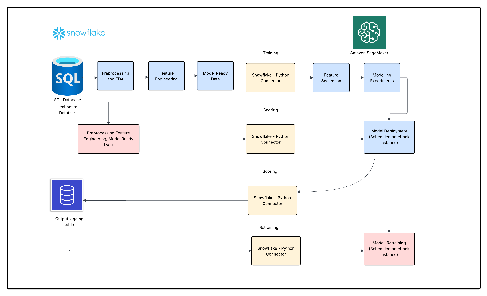

# Healthcare Analytics to predict Patients' length of hospital stay integrating snowflake and AwS 
## Project Description
This project focuses on the analysis of healthcare data which is stored in the snowflake database system having a cloud-based architecture, to predict a patient's length of stay at hospital at the time of admission.AWS sagemaker is use to create a scheduled python notebook instance for model building and development and then real-time predictions are made using the trained model.Resulting predictions from the new data which are fetched at the scheduled time are fed back to the database system and stored in a seperate logging table for later use for model retraining and improvements. The intent of saving the predictions in the logging table is to analyze the  model preditions made over a period of time and  use that information for refining the model for improved predictive accuracy.

## Business Overview
 A critical area in the healthcare management is to improve the delivery of its services and  ensure patient outcomes. Analyzing the length of the stay (LOS) of patients at the time of admitting to the hospital would help healthcare providers to identify the areas to improve the delivery of care and make data driven decisions in the cost management.By analyzing the factors contribute the variation in LOS, business teams can derrive insights regarding the patients who have a risk of extending the LOS, in order to allocate available  resources in a timely manner for all patients, reducing unexpected outcomes and  costs due to facility limitations and operational defficiencies. In overall Analyzing the LOS is a critical aspect in the healthcare analytics which helps organizations gain a deeper understanding about the inpatient care and cost management. 

 ## Project Architecture 
 
As shown in the reference architecture, the  Exploratory Data Analysis(EDA) and the
