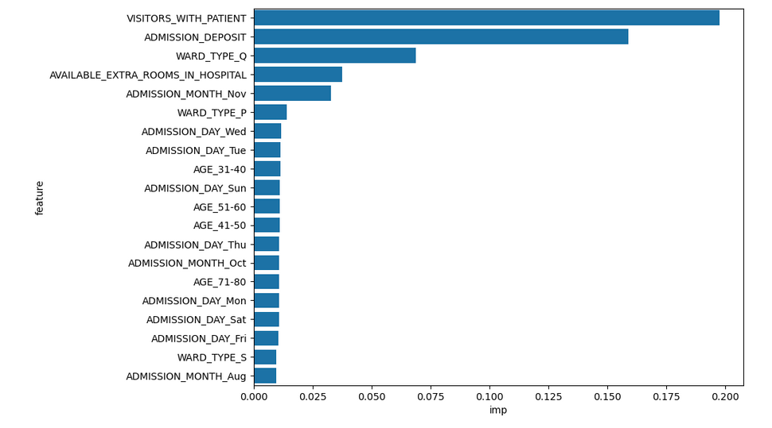
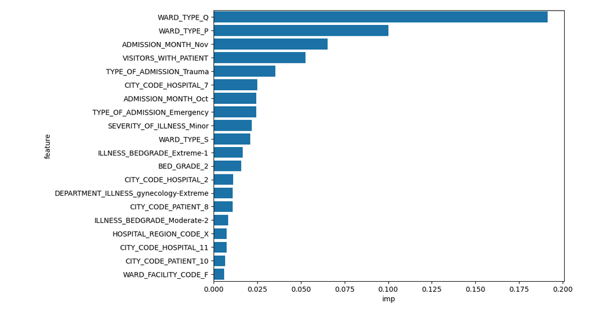
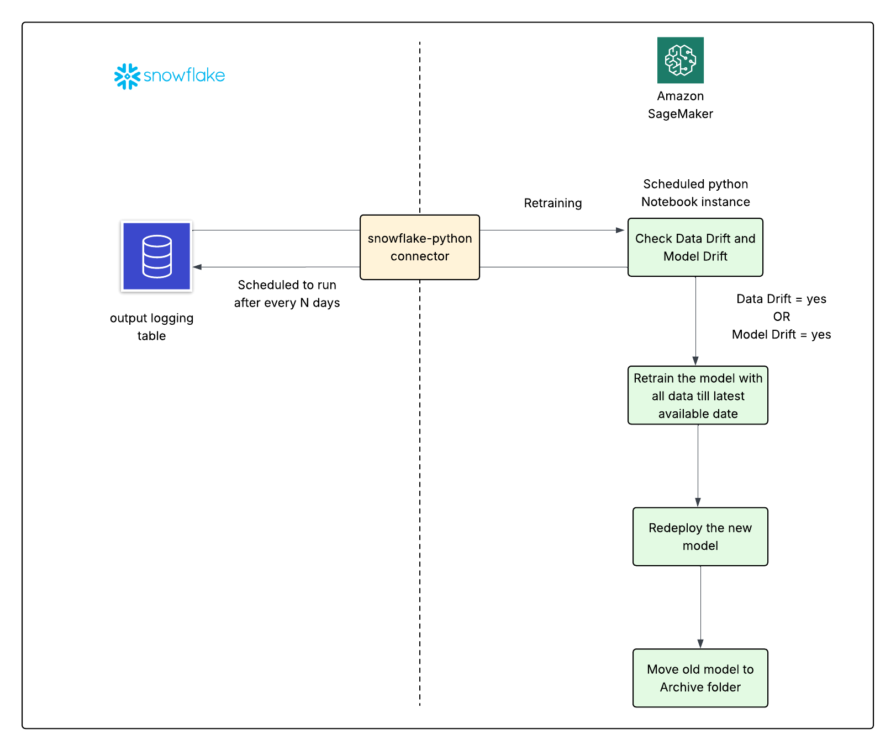

# Healthcare Analytics to predict Patients' length of hospital stay integrating snowflake and AwS 
## Project Description
This project focuses on the analysis of healthcare data which is stored in the snowflake(a cloud-based data warehousing platform and database management system), to predict a patient's length of stay at hospital at the time of admission.AWS sagemaker is use to create a scheduled python notebook instance for model building and development and then real-time predictions are made using the trained model.Resulting predictions from the new data which are fetched at the scheduled time are fed back to the database system and stored in a seperate logging table for later use for model retraining and improvements. The intent of saving the predictions in the logging table is to analyze the  model preditions made over a period of time and  use that information for refining the model for improved predictive accuracy.This project showcases the development of a comprehensive data pipeline, building of a machine learning model for real-time data scoring, simulation of live data scoring and building of the model retraining pipeline.
## Business Overview
 A critical area in the healthcare management is to improve the delivery of its services and  ensure patient outcomes. Analyzing the length of the stay (LOS) of patients at the time of admitting to the hospital would help healthcare providers to identify the areas to improve the delivery of care and make data driven decisions in the cost management.By analyzing the factors contribute the variation in LOS, business teams can derrive insights regarding the patients who have a risk of extending the LOS, in order to allocate available  resources in a timely manner for all patients, reducing unexpected outcomes and  costs due to facility limitations and operational defficiencies.In overall Analyzing the LOS is a critical aspect in the healthcare analytics which helps organizations gain a deeper understanding about the inpatient care and cost management. 
 
 ## Project Architecture 
 
As shown in the reference architecture, 
1. the  Exploratory Data Analysis(EDA) and the Feature Engineering steps are performed in snowflake
2. Data Preprocessing, Feature Selection and Model building and training steps are performed in AWS sagemaker
3. The logging table for storing predictions in the scoring process is stored in the snowflake
4. The model retraining pipeline is developed and depoyed in the AWS sagemaker notebook.
5. The Snowflake and AWS SageMaker environments are integrated using the Snowflake Python Connector.

## Core Objectives 
 1. Build a machine learning model to predict the LOS of patients.
 2. Simulate live data scoring and insert predictions to the logging table.
 3. Send status email at each step of model bilding pipeline using SMTP mail.
 4. Build end to end retraining pipeline for checking model drift and data drift and redeploy the model.

## Data 
The training data loaded in snowflake are collected from 230k patients across various regions and hospitals. There are total 19 features available in the [training dataset](Data/health_data.csv). The [simulation dataset for scoring process](Data/simulation_data.csv) has data collected from 71K patients.

## Exploratory Data Analysis - Snowflake Database 
In order to store the datasts, a snowflake data table( **HEALTH_DB**) created in a new database and schema **HEALTHDB.HEALTH_SCHEMA** in snowflake. A univariate analysis was performed on each feature to understand the distribution of data and outliers within a single variable. Then the variablity of patient's length of stay(LOS) with the type and demographics of the hospital and facility, the age of patients, type of admission, severity of illness were analyzed in order to understand the average LOS patients. The following are the major insights derrived from the [EDA](SQL_Queries/Snowflake-EDA.sql).

 - Patients admitted to surgery department located in hospital_region_code 'Z' has the highest average LOS, which is 40 days , whereas those in the Anesthesia department in hospital_region_code 'X' had the shortest average LOS, at just 31 days.
 - There was no consistent trend observed between the LOS of patients with the available extra rooms in the hospital, however the highets average LOS of patients recorded as 60 days was for the highest number of available extra rooms  which is 20 in total.
 - Patients who were admitted due to Trauma or extreme severity ilness had the highest average LOS, while those admitted for minor severity illnesses or through emergency admissions had the lowest average LOS.
 - There was no significant variation in the average LOS across different age groups; however, the oldest patients recorded the highest average LOS at 37 days.

## Feature Engineering - Snowflake Database 
Insights gained from the EDA, domain knowledge and data transformation techniques were applied to engineer new input variables, modify and transform existing variables and select the most releveant features to reduce the noise and improve the efficiency and performance of the model. In order to perform this, two Common Table Expressions(CTE)s were created; **BASE** CTE comprises all columns from the dataset, filtering out null values using the COALESCE() expression and **BASE_WITH_FEATURES** CTE builds upon **BASE**, incorporating engineered features derived from its selected columns.
```python
   WITH BASE AS (

    SELECT CASE_ID,
           COALESCE(HOSPITAL_CODE,0) AS HOSPITAL_CODE,
           COALESCE(HOSPITAL_TYPE_CODE,'None') AS HOSPITAL_TYPE_CODE,
           COALESCE((SEVERITY_OF_ILLNESS,'Minor') AS SEVERITY_OF_ILLNESS,
           ............ # select rest of the column names from dataset

   FROM HEALTHDB.HEALTHSCHEMA.HEALTH_DATA),

  BASE_WITH_FEATURES AS (
    SELECT *,
            MONTHNAME(ADMISSION_DATE) AS ADMISSION_MONTH,
            DAYNAME(ADMISSION_DATE) AS ADMISSION_DAY,
            CONCAT(TYPE_OF_ADMISSION,'-',SEVERITY_OF_ILLNESS) AS ADMISSION_ILLNESS,
            CONCAT(SEVERITY_OF_ILLNESS,'-',BED_GRADE) AS ILLNESS_BEDGRADE,
            CONCAT(DEPARTMENT,'-',SEVERITY_OF_ILLNESS) AS DEPARTMENT_ILLNESS,
            DATEDIFF(day,ADMISSION_DATE,DISCHARGE_DATE) AS LOS   # uses DATEDIFF() function to calculate the difference of days
    FROM BASE )

SELECT * FROM BASE_WITH_FEATURES;  
```
## Preprocessing - AWS Sagemaker Notebook Instance 
The preprocessing steps were conducted in a Python notebook instance within AWS SageMaker, utilizing feature-engineered data queried from the Snowflake database via the Snowflake-Python connector. The Python notebook is utilized for its seamless data exploration, interactive and iterative development, and extensive support for Python libraries and extensions, facilitating efficient data analysis and model building.

 - Create a SQL engine in python
   ```python
   import sqlalchemy
   from sqlalchemy import create_engine
   engine= create_engine(URL( account="..",
        user= snowflake_creds.USER_NAME,
        password= snowflake_creds.PASSWORD,
        role="ACCOUNTADMIN",
        warehouse="COMPUTE_WH",
        database="HEALTHDB",
        schema="HEALTHSCHEMA"
    ))
   ```

  - Create a snowflake-python connector to query data from Snowflake
    ```python
       with engine.connect() as conn:
          df=pd.DataFrame(pd.read_sql(text(query),conn))
          df.columns=[col.upper() for col in df.columns.tolist()] # convert all column names to uppercase
    ```

The preprocessing steps were saved in **preprocess_data(df)** function within [LOS_Preprocessing](Python_notebook/LOS_Preprocessing.py) script to reuse the same steps during the scoring process and model retraining process.This minimizes data inconsistencies when querying incoming data, helping to maintain reliable and accurate model results. Following steps were performed in preprocessing. 

- Dropping unwanted columns and reset the index
  ```python
  cols_to_drop=[['HOSPITAL_CODE','PATIENTID','ADMISSION_DATE','DISCHARGE_DATE'] #LOS is calculated,admission & discharge date are not needed
  df = df.drop(cols_to_drop,axis=1)
  df.set_index('CASE_ID',inplace=True)```

- Fixing datatype issues to ensure numerical and categorical columns have correct datatype
  ```python
  num_cols=['AVAILABLE_EXTRA_ROOMS_IN_HOSPITAL','VISITORS_WITH_PATIENT','ADMISSION_DEPOSIT','LOS']
  cat_cols=[col for col in df.columns.tolist() if col not in num_cols]
  for col in cat_cols:
      df[col]= df[col].astype(object)
  for col in num_cols:
      df[col]=df[col].astype(int)
  ```

 - One hot encode categorical variables, to have them in appropriate format for model building
   ```python
   df_final=pd.get_dummies(df)
   ```
 ## Feature Selection - AWS Sagemaker 
To identify the most relevant features for the final model, feature importance was calculated using two supervised regression algorithms: DecisionTree and XGBoost (XGB). The preprocessed dataset was then divided into training and test sets, ensuring each predictive model, built using these algorithms, was evaluated effectively.
```python
from sklearn.model_selection import train_test_split
from sklearn.tree import DecisionTreeRegressor
import xgboost as xgb

# Build models using each algorithms and calculate R2
  dtree=DecisionTreeRegressor()
  dtree.fit(x_train,y_train)
  dtree.score(x_train,y_train) 

  xgb_=xgb.XGBRegressor()
  xgb_.fit(x_train,y_train)
  xgb_score(x_train,y_train) # The putput gives R2 value or coefficient of determination

# Calculate feature importance on trainnig set using each predictive algorithm

feat_imp_dtree=pd.DataFrame(zip(x_train.columns,dtree.feature_importances_),columns=['feature','importance']).sort_values(by='importance',ascending=False)

feat_imp_xgb=pd.DataFrame(zip(x_train.columns,xgb.feature_importance_),columns=['feature','importance']).sort_values(by='importance',ascendng = False)
```

        ***Image 1: Feature importances obtained using DecisionTreeRegressor***
 
         ***Image 2: Feature importances obtained using xgbRegressor***

Since most features had small values for the feature impotance, a union of features from both models that had an importance above 0.01 is selected as the final list of features for the model building and it is saved as a [pickle file](model_building_retraining_artifacts/MODEL_FEATS.pkl) for the future use during scoring and retraining processes. A dataframe containing the final list of features and target variable "LOS" is saved as a seperate [pickle file](model_building_retraining_artifacts/MODEL_training_data_with_final_features.pkl) for future use. The following features are selected as the final list;

`{'ADMISSION_MONTH_Nov', 'ADMISSION_DAY_Tue', 'ADMISSION_DAY_Thu', 'ILLNESS_BEDGRADE_Extreme-1', 'AGE_41-50', 'ADMISSION_MONTH_Oct', 'ADMISSION_DAY_Wed', 'VISITORS_WITH_PATIENT', 'CITY_CODE_HOSPITAL_7', 'WARD_TYPE_P', 'AVAILABLE_EXTRA_ROOMS_IN_HOSPITAL','AGE_71-80' 'WARD_TYPE_Q','ADMISSION_DEPOSIT', 'AGE_31-40', 'BED_GRADE_2', 'TYPE_OF_ADMISSION_Trauma', 'CITY_CODE_PATIENT_8', 'ADMISSION_DAY_Mon', 'TYPE_OF_ADMISSION_Emergency','ADMISSION_DAY_Fri', 'CITY_CODE_HOSPITAL_2', 'ADMISSION_DAY_Sun', 'ADMISSION_DAY_Sat', 'WARD_TYPE_S',
 'SEVERITY_OF_ILLNESS_Minor'}`
## Model Building - AWS Sagemaker

The **[MODEL_training_data_with_final_features.pkl](model_building_retraining_artifacts/MODEL_training_data_with_final_features.pkl)** file saved during feature selection is used to create training and testing splits of X and Y data and those data are used to calculate the *rmse(root mean squared erorr)* and *mae(mean absolute error)* from three types of regression models; linear regression, randomforestregression and xgbregression. The following table shows the results obtained from each model.

|Model|R2 score|RMSE|MAE|
|--|--|--|--|
|Linear Regression|0.183|15.21|3.37|
|Random Forest Regression|0.899|14.25|3.25|
|XGB Regression|0.396|13.58|3.17|

Since XGB Regressor resulted the minimum values for rmse and mae, the XGB Regressor is selected as the appropriate model in this project to gain higher accuracy and credibility in the model predictions. Then its booster is saved as the [Trained Model](model_building_retraining_artifacts/MODEL_XGB.model). The values obtained for rmse and mae were insesrted into a new dictionary and saved as the [XGB model performance metrics](model_building_retraining_artifacts/MODEL_XGB_PERFM_METRICS.pkl) pickle file.

## Scoring Process 
The scoring process involves storing model predictions in a dedicated table within the Snowflake database. This logged data allows for efficient retrieval, enabling analysis of model performance over time. By tracking predictions, users can evaluate accuracy, detect patterns, and refine the model based on insights derived from historical results, ultimately improving its effectiveness. The scheduled [scoring function](preprocessing_pipeline/Scoring_Script_vidisha.ipynb) for deployment includes several key steps.
1. Retrieval of scoring data from snowflake database.
2. Applying preprocessing steps and prepare the data for model predictions.
3. Model inference by applying the trained model to get predictions.
4. Inserting the predictios to the logging table created in the snowflake for tracking and analysis.
5. Automated execution by scheduling recurrence runs to ensure continuous update to the logging table.
6. Send status email at each step to admin users using SMTP.
### 1. Retrieval of the scoring data
 - A SQL query utilizing two CTEs, as outlined in the [Feature Engineering - Snowflake Database](#Feature-Engineering---Snowflake-Database) is used to retrieve  [simulation dataset](Data/simulation_data.csv), which is stored in **HEALTHDB.HEALTHSCHEMA.SIMULATION_DATA** snowflake table.
 - The retrieved data is loaded into the Python notebook instance in AWS SageMaker using the Snowflake-Python connector and then transformed into a DataFrame for further processing.
### 2. Applying preprocessing and Feature selection
- To ensure that incoming new data aligns with the features used during model training, the **check_n_create_model_features(df, feat_list)** function is designed to validate the presence of expected columns and automatically add any missing ones with zero values.
  ```python
  def check_n_create_model_features(df,feat_list):
      test=pd.DataFrame()
      for col in feat_list:
           if col in df.columns.tolist():
                test[col]=df[col]
           else:
                 test[col]=0
       return test
  ```
- The **preprocess_data(df)** function from [LOS_Preprocessing](preprocessing_pipeline/LOS_Preprocessing.py) script is used to preprocess the input data.After preprocessing, the [list of final model features](model_building_retraining_artifacts/MODEL_FEATS.pkl) selected during training process is loaded and passed to the **check_n_create_model_features(df, feat_list)** to generate final cleaned and feature aligned dataframe.


## Retraining pipeline

## Steps in the retraining pipeline 
1. Create the Data drift detector object using the training data and save the detector as a pickle file for use during retraining.
2. Create a schedule which runs periodically to check a data drift from the data in the logging table created during the scoring process and to raise a trigger if there's a drift.
3. Build a model drift detector, and a model monitoring function that uses "LOS" and "predicted_LOS" columns from logging table data queried in batches to calculate the current performance metrics and compare it against the  reference performance metrics calculated during initial training to detect a drift.
4. If the retrain trigger is activated, retrieve all data from the logging table up to the when periodic time window begins and retrain the model on new data, then save the retrained model on a seperate folder called " Retrain Artifacts".
5. Old trained model and newly retrained model should be tested  on the remaining data in the logging table, which is only within the priodic time window (testing data) to evalaute the model performance by comparing their performance metrics.
6. Once the final model is selected, the other model should be pushed to "Archives" folder and the selcted model should be in the currect directory along with its features and mappings.

### 1. Buiding Data Drift Detector 

Alibi python library is used  to build the data drift detector due to its simplicity and versality in  data detection. 
- It uses the **TabularDrift** method which performs **feature-wise test** to comapre the statistical properties of the features in the reference dataset(trainng dataset) against the new dataset to identify a data drift. The **feature-wise- test** uses **Chi-square** test for categorical features and **two sample Kolmogorov- Sirmonov** test for continuous numerical data.
- To reduce the complexity and improve the computational efficiency ,each categorical features and their categories are converted to numeric values before passing the features to the data drift detector.(Knowing the categorical data allows detector to seperately identify categorical and numerical data to apply appropriate statistial test)

```python
import alibi
from alibi_detect.cd import TabularDrift
# A list containing  categorical columns' indices derrived from the X_train dataframe and a dictionary with None values passed for each index are created to allow detector to infer the numerical values from the reference data.
catgeories_per_feature= { f: None for f in cat_indices}
# Initialize the data drift detector
cd=TabularDrift(x_train.values,p_val=0.05, categories_per_feature=categories_per_feature)
# saving the data detector as a pickle file
with open ("Trained_Drift_Detector.pkl", "wb") as F:
      pickle.dump(cd,F)
```
### 2. Schedule a periodic data drift detection during scoring 
Due to the large volume of data, detection is performed in batches of 7 days periodically, collecting data within a specified time window.

- **data_monitoring_batch_query(a)** function is created to query the real time data from the logging table periodically. It use the "ADMISSION_DATE" column to specify the time window. This function only querys necessary feature columns and eliminates target variable 'LOS' or 'PREDICTED_LOS' during the quering process.
  ```python
  def data_monitoring_batch_query(a):
  from sqlalchemy import text
      query= f''' SELECT ..., ....,....                # select all necessary column names from logging table
                  FROM HEALTHDB.HEALTH_SCHEMA.LOGGING_TABLE
                  WHERE ADMISSION_DATE >= CURRENT_DATE +N -(a*7) AND ADMISSION_DATE < CURRENT_DATE +N - {(a+1)*7}'''
       # N= difference of days from current date to the begining of data, a= batch id
       return text(query)
  ```

- **data_monitoring(batch_id)** functions is created to load the training data until the specified time window, prepare the final data frame which is ready to check the data drift, by applying the trained data drift detector.

```python
def data_monitoring(batch_id):
    with engine.connect() as conn:
         batch_df=pd.DataFrame(pd.read_sql(data_monitoring_batch_query(batch_id),conn)) #query the data from SQL using snowflake-python connector 

   batch_df.columns=[col.upper() for col in batch_df.columns.tolist()] # preprocess column names for consistency
   cat_cols=[..,...,...]
   num_cols= [..,...,...]# define categorical columns and numerical columns from the df
   batch_final=batch_df[cat_cols+num_cols] # prepare the final dataframe ready for data drift detection

   with open(" Trained_Drift_Detector",'rb') as F:     # load the trained detector saved as a pkl file
       trained_drift_detector_model=pickle.load(F)
  fpreds=trained_drift_detector.predict(batch_final.values, drift_type=feature) # detect the data drift on the new data feature wise

  log_df=pd.DataFrame() # Add results of the fpreds to this dataframe
  log_df['Time period']= ([str(batch_df['ADMISSION_DATE'].max()) + 'to' + str( batch_df['ADMISSION_DATE].min())]*   # define the time period batch is processed
                                            len(batch_final.columns.tolist()])
  log_df['Features'] = final_df.columns.tolist()
  log-df['Is Drift'] = fpreds['data']['is_drift']
  log_df['Stat test'] = log_df['Features'].apply( lambda x: 'chi2' if x in cat_cols else 'KS')
  log_df['stat value'] = np.round(fpreds['data']['distance'])
  log_df['p-value'] = np.round(fpreds['data']['p_val'])

  return log_df
```
### 3. Build Model Drift detector
    
- Create **model_drift_check** function that detects drift in the model based on performance metrics of each model, based on the type of the predictive model
  ```python
  def check_model_drift(ref_metrics_dict,current_metrics_dict,type='classification', tol=0.1)
      if type == 'classification'; # following performance metrics are used if a classification model
          precision_change=abs((cur_metric_dict['Precision']-ref_metric_dict['Precision'])/ref_metric_dict['Precision'])
          recall_change=...... # calculate recall change
          roc_auc_change=..... # calculate roc_auc change

          counter=0
          for i in [precision_change, recall_change,roc_auc_change]:
                if i > tol:
                    conter +=1
          if counter > 0:
              print(" There is a model drift")
              return 1
          else:
              print('There is no model drift')
              return 0, precision_change, recall_change, roc_auc_change
  
      elif type =='regression':
           rmse_change=abs((cur_metric_dict['RMSE']-ref_metric_dict['RMSE'])/ref_metric_dict['RMSE'])
           mae_change=abs((cur_metric_dict['MAE']-ref_metric_dict['MAE'])/ref_metric_dict['MAE'])
          
          counter=0
          for i in [rmse_change, mae_change]:
                if i > tol:
                    conter +=1
          if counter > 0:
              print(" There is a model drift")
              return 1
          else:
              print('There is no model drift')
              return 0, rmse_change, mae_change # return the changes in metrics if there is a model drift
             
       else:
            print("There is no model drift.")
            rmse_change = 'NONE'
            mae_change = 'NONE'
            return 0, rmse_change, mae_change
  ```
### 3. Schedule periodic model drift detection during scoring

- Build **model_monitoring_batch_query(a)** function to query all data from the logging table in batches for the specified time window
  ```python
   def model_monitoring_batch_query(a):
   from sqlalchemy import text
         query_sim = f'''
                     SELECT *   # select all columns from the logging table
                     FROM HEALTHDB.HEALTH_SCHEMA.LOGGING_TABLE
                     WHERE ADMISSION_DATE >= CURRENT_DATE-N+{a*7} AND ADMISSION_DATE < CURRENT_DATE-N+{(a+1)*7}
        return text(query_sim)
  ```
- Build **model_monitoring(batch_id)** to periodically detect the model drift from the scoring data
  ```python
  def model_monitoring_batch(batch_id):
        with engine.connect() as conn:
            batch_df=pd.DataFrame(pd.read_sql(model_monitoring_batch_query(batch_id),conn)) #query the data from SQL using snowflake-python connector 

       # create the current performance metrics using the scoring data
       actual=batch_df['LOS_X']
       predicted = batch_df['PREDICTED_LOS']

       rmse = np.sqrt(metrics.mean_squared_error(actual,predicted))
       mae= np.sqrt(metrics.mean_absolute_error(actual,predcited))

       scoring_ref_metrics={}
       scoring_ref_metrics['rmse']=rmse
       scoring_ref_metrics['mae']=mae

       # load reference performance metrics dictionary which was saved during initial training
       
        with open('MODEL_XGB_PERFM_METRICS.pkl', 'rb') as F:
                model_ref_metrics=pickle.load(F)

  
      # detect the model drift and log (the treshold for performance metrics is 0.1 and model type is regression model).
      model_drift, rmse_change,mae_change = check_model_drift(model_ref_metric,scoring_ref_metrics,type='regression',tol=0.1)
    
      # Log values
    log = {}
    log['Time Period'] = str(batch_df['ADMISSION_DATE'].min()) + ' to ' + str(batch_df['ADMISSION_DATE'].max())
    log['Scoring Metrics'] = scoring_ref_metrics
    log['Training Metrics'] = model_ref_metric
    log['Model Drift IND'] = model_drift
    log['RMSE Change'] = RMSE_CHANGE
    log['MAE Change'] = MAE_CHANGE
   return log
    ```
### 4. Retraining the model 
- Create retraining helper functions to retrieve the latest data and perform feature engineering, feature selection, and data preprocessing using previously saved functions from the original model training.
- Once new model is retrained, it is saved in a "Retrain Artifacts" folder along with all new features and model performance metrics in seperate pickle files.
- **create retraining_batch_queryc(max-date)** function to query data for the retraining process which is union of original training data and new data saved in the logging table during scoring process. max_date is when the periodic time window begins in every batch.


  ```python
  def create_retraining_batch_query(max_date):
      query= f''' WITH TRAIN_BASE AS (
                     SEELECT ...,....,...                   # select all columns after converting them to contain non-null values using COALASCE() method
                     FROM HEALTHDB.HEALTH_SCHEMA.HEALTH_DATA
                     WHERE ADMISSION_DATA >'2022-11-01'),     # reduce the data load
  
                  WITH TRAIN_BASE_WITH_FEATURES AS (
                       SELECT *, .....,..... # does feature engineering to add new columns
                       FROM TRAIN_BASE),
                  WITH NEW_DATA_WITH_FEATURES AS(
                        SELECT * , ...,....,   # select all other columns in the logging table except the " PREDICTED_LOS" column which is the taget variable
                        FROM HEALTHDB.HEALTH_SCHEMA.LOGGING_TABLE
                        WHERE ADMISSION_DATE > max_date)

                 SELECT *
                 FROM TRAIN_BASE_WITH_FEATURES
                 UNION ALL
                 SELECT *
                 FROM NEW_DATA_WITH_FEATURES; '''

       return text(query)
  ```
-  **create retrain_model(cutoff_date)** function which retrains the model. The queried data is split into training and testing datasets based on the cut off date, by which the testing split would be data queried from the logging table within the duration of the time-window which is 7 days in this project.
   - This function applies the predefined functions **check_n_create_model_features(df,feat_list)** to format the features in the new dataframe according to the expected list of features/columns.
   - Afterwards it applies the **feature_selection(df)** to apply the DecisionTreeRegressor and XGBRegressor to find the final list of model features and save it as a new pickle file under the 'Retrain Artifacts' folder.
   - The function returns the performance metrics dictionaries for the predictions made by both retrained model and old model on the  latest test dataset.

```python
def retrain_model(cutoff_date):
      with engine.connect() as conn:
         data = pd.DataFrame(pd.read_sql(retraining_batch_query(cutoff_date),conn))
         data.columns = [col.upper() for col in data.columns.tolist()]


        # Splitting the data into Train and Test set
        import pytz    
        from datetime import datetime, timedelta
        tz_NY = pytz.timezone('America/New_York')

        max_date = data.ADMISSION_DATE.max()
        min_date = max_date - timedelta(days=7) # periodically scheduled time window is 7 days

        data_train = data[(data['ADMISSION_DATE'] <= min_date)]
        data_test = data[(data['ADMISSION_DATE'] >= min_date) & (data['ADMISSION_DATE'] <= max_date)]


        # Applying the preprocessing steps using LOS_Preprocessing script
        df_train_processed = LOS_Preprocessing.preprocess_data(data_train)
        df_test_processed = LOS_Preprocessing.preprocess_data(data_test)
        

        # Performing feature selection using predefined function to find the final list of features for the model

        df_final = df_train_processed.copy()
        print("Feature Selection Started..")
        model_feats = feature_selection(df_final)
        model_feats.remove('LOS') # Selects X_train for model retraining 


        # Model Building
        import xgboost as xgb
        xgb_ = xgb.XGBRegressor()
        xgb_.fit(df_final[model_feats],df_final['LOS']) # Fit the model for X-train and y_train

         # Use check_n_create_model_features function to create the final test df given the selected features
        df_test_final = check_n_create_model_features(df_test_processed,model_feats)
        if 'LOS' in df_test_final.columns.tolist():
            df_test_final = df_test_final.drop('LOS',axis=1) # extract X-test dataset

        # make predictions using the retrained model 
        preds = np.ceil(xgb_.predict(df_test_final))  #df_test_final contains the x_test data
        rmse = np.sqrt(metrics.mean_squared_error(df_test_processed['LOS'],preds)) # uses actual and predicted LOS values
        mae = np.sqrt(metrics.mean_absolute_error(df_test_processed['LOS'],preds))
        print("\n Test Performance (new model)")
        print("RMSE: ", rmse)
        print("MAE: ", mae)      

        # Saving the retrained model 
        booster = xgb_.get_booster()
        booster.save_model('Retraining Artifacts/MODEL_XGB.model')

        model_xgb_metrics_new = {}
        model_xgb_metrics_new['RMSE'] = rmse
        model_xgb_metrics_new['MAE'] = mae

        # saving the model metrics of the retrained model
        import pickl
        with open('Retraining Artifacts/MODEL_XGB_PERFM_METRICS.pkl','wb') as F:   
            pickle.dump(model_xgb_metrics_new,F)


        
        # Getting the predictions from the old model
        model = xgboost.XGBRegressor()
        model.load_model('MODEL_XGB.model')
        
        with open('MODEL_FEATS.pkl','rb') as F:
            model_feats_old = pickle.load(F)

        df_test_final = check_n_create_model_features(df_test_processed,model_feats_old)
        if 'LOS' in df_test_final.columns.tolist():
            df_test_final = df_test_final.drop('LOS',axis=1)

        # make predictions using the old model
        preds = np.ceil(model.predict(df_test_final))
        rmse = np.sqrt(metrics.mean_squared_error(df_test_processed['LOS'],preds))
        mae = np.sqrt(metrics.mean_absolute_error(df_test_processed['LOS'],preds))
        print("\n Test Performance (old model)")
        print("RMSE: ", rmse)
        print("MAE: ", mae)   

        model_xgb_metrics_old = {}
        model_xgb_metrics_old['RMSE'] = rmse
        model_xgb_metrics_old['MAE'] = mae
    
    return model_xgb_metrics_new, model_xgb_metrics_old
```
### 5. Finalizing the model
- By comparing the old model and new model, the best model is selected and the other one is moved to "Archive" folder to retain the information about the training history.

  ``` python
  def finalize_model(new_perform_dict,old_perform_dict):
  count = 0
      for metric in new_perform_dict.keys():
              if  new_perform_dict[metric] < old_perform_dict[metric]:
                      count +=1
     if count > 0:
        return "new model"
     else:
        return "old model"
  ```

  ```python
  def deploy_model(select="old model"):
       if select != "old model":
            # STEP 1
            #load the old model and associated features and metrics files
             import xgboost as xgb
             model=xgb.Booster()
             old_model= model.load_model("MODEL_XGB.model")
             ........... # load features and metrics files 

            # Move the old model to Archive folder
             with open('Archive/MODEL_XGB.model','wb') as F:
                     pickle.dump(old_model,F)
             ........... # save features and metrics files to Archive folder
        else:
            
             #load the new model and associated features and metrics files
             import xgboost as xgb
             model=xgb.Booster()
             new_model= model.load_model("Retraining Artifacts/MODEL_XGB.model")
             ........... # load feature and metrics files 

            # Replace the old model artifacts with new model 
             with open('MODEL_XGB.model','rb') as F:
                     pickle.dump(new_model,F)
             ........... # Replace features and metrics files 

       return " Deployment Successfull"
  ```
### 6. Retraining trigger condition
  
  The retraining trigger on the condition if any one of the model drift or data drift was occured. Then it executes the retraininig helper functions and model finalizatio function to automatically replace the selected the model as the current model. 


 ```python
if data_drift==True or model_drift==True:
    # Do retraining
    print('Retraining started...')
    new_dict, old_dict = retrain_model(cutoff_date)

    # finalize the model
    print('Model selection started...')
    select_model = finalize_model(new_perform_dict=new_dict, old_perform_dict=old_dict)

   #Deploy the selected model
    print('Model deployment started...')
    deploy_model(select_model)
```


